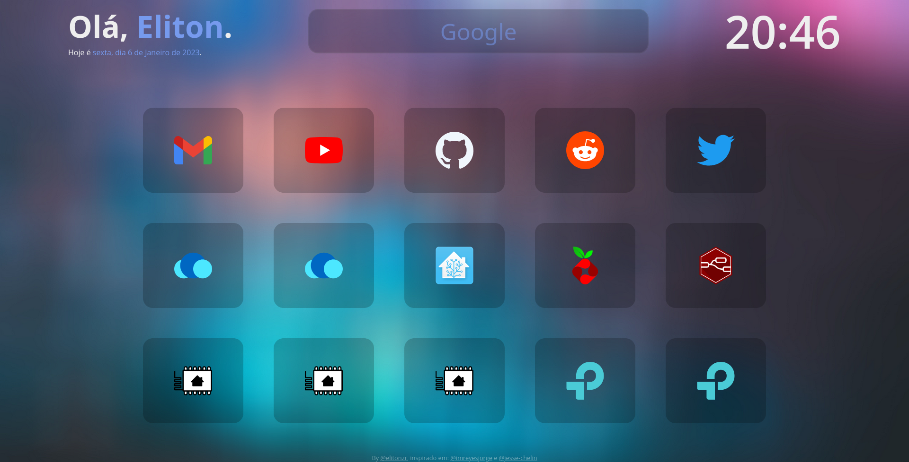

### Root é uma página inicial voltada para simplicidade e elegância

Este projeto é extremamente rápido :zap:, contém apenas arquivos html, css e javascript.

## Personalizando

O Root foi criado para ser leve, rápido e fácil de customizar.

### Mudança de Cores

Para alterar as cores usadas na página inicial, edite `styles.css`.

```css
:root {
  --primary: #dd2e44;
  --text-light: #eeeeee;
  --background: #1e1c21;
  --background-light: #333138;
}
```

### Alteração de nome e adição de cartões personalizados

> Este projeto usa [Remix Icons](https://remixicon.com/).

Para alterar o nome padrão e editar os cartões, edite `app.js`. Deve ser algo como isto:

```js
const NAME = "John Doe";

const CARDS = [
  {
    name: "Twitter",
    icon: "ri-twitter-fill",
    link: "https://twitter.com",
  },
  {
    name: "Github",
    icon: "ri-github-fill",
    link: "https://github.com/",
  },
];
```

Para adicionar um novo cartão, basta anexar um novo objeto à constante `CARDS`. O objeto deve se parecer com isto:

```js
{
  name: "<Webpage Name>",
  icon: "<Icon Class-Name>",
  link: "<Webpage Link>",
  clipboard: true,
  color: '#550499'
},
```

> Para obter o nome da classe do ícone, basta acessar [Remix Icons](https://remixicon.com/), selecionar o ícone desejado. Você deve ver algo como isto: `<i class="this-is-the-class-name"></i>`.

> Se você preferir copiar o link para a área de transferência em vez do comportamento padrão, basta adicionar `clipboard: true` ao objeto do cartão.

> A cor de destaque do cartão individual opcional pode ser obtida definindo uma propriedade `color: string` no objeto do cartão.

Para usar o horário de 24 horas, basta alterar a seção de tempo de `app.js` para
```
// Atualiza a hora
  currentTime.innerHTML = `${currentHour}:${currentMinute}`;
```
